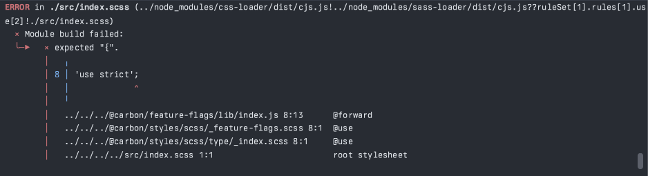

This is a pretty simple demonstration of an issue with the sass-loader running
with RSpack.

With Webpack, this code builds without any issues; however, running the same
build with RSpack consistently results in this error:



The Sass here is obviously a little nested, so from the included file we then
hit the rule:

`@carbon/styles/scss/type/_index.scss`:
```scss
@use '../feature-flags' as *;
```

This then has the rule:

`@carbon/styles/scss/_feature-flags.scss`:
```scss
@forward '@carbon/feature-flags'
```

Which is being resolved to `@carbon/feature-flags/lib/index.js` instead of
`@carbon/feature-flags/index.scss`. `/lib/index.js` is the `main` entry in the
`@carbon/feature-flags` library, so it makes sense why it would resolve this
way, but it's clearly losing something in the context.
